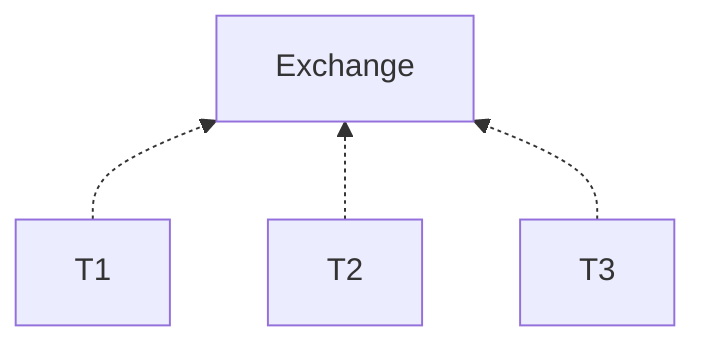
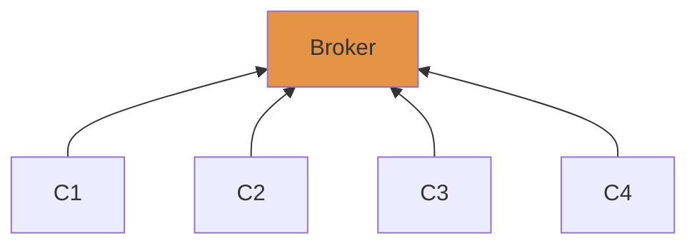
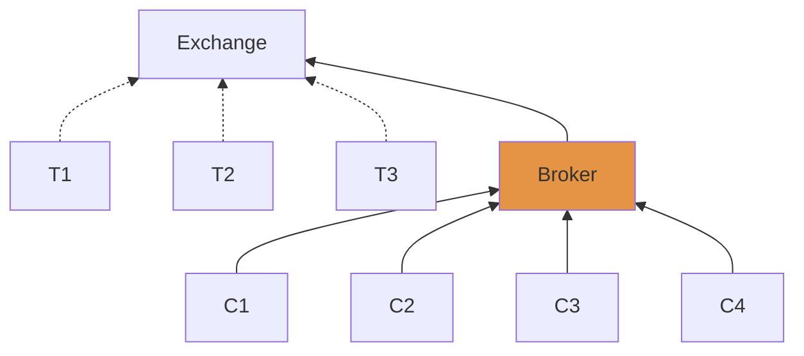
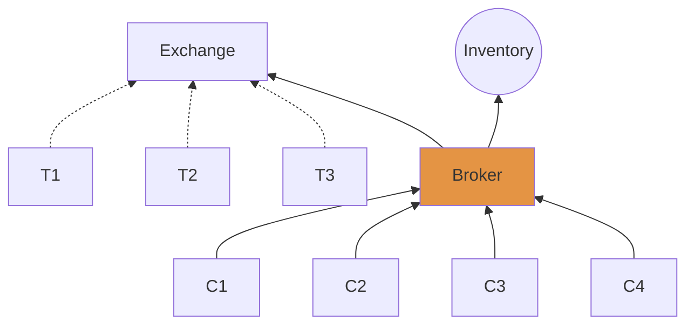
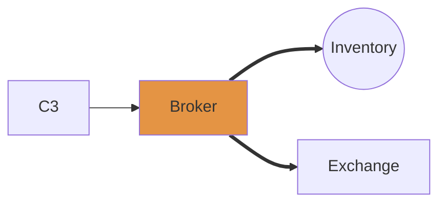
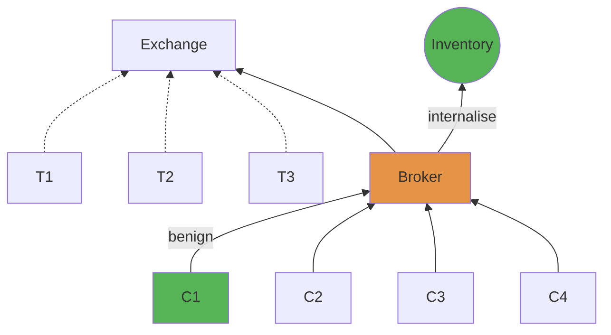
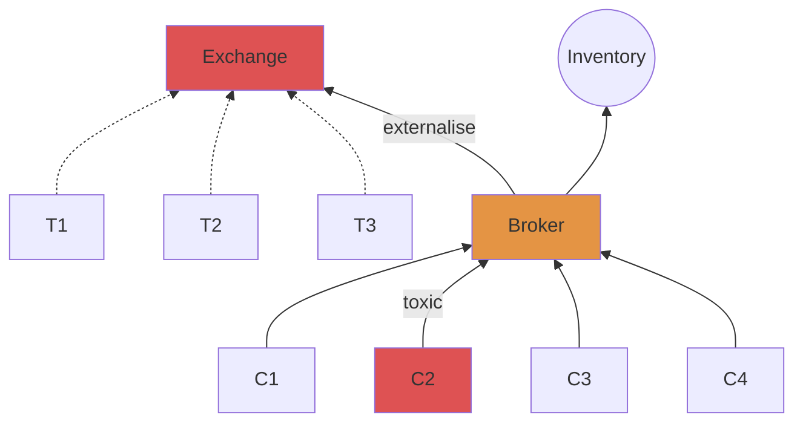

# Detecting toxic flow

---
layout: center
---

# Forex (FX) trading from a Broker’s POV

Two kinds of *markets*

---

### Trading in an exchange

- Place an order to buy (or sell) at any price (via a limit order)
- Order gets filled only if matched in the limit order book (LOB)



---

### Trading with a broker

- Bid and ask prices set by the broker
- No limit order book



Our paper follows the POV of the broker

---

# Broker - Exchange relationship

Broker is a participant of the exchange

- dotted line: what the broker cannot see
- straight lines: what the broker can see



---

# Brokers and the problem of toxic flow

- Broker uses inventory to provide liquidity



---

## Broker’s dilema: to internalise or not to internalise?

- Internalise: taking the trade in the inventory
- Externalise: selling (or buying) the quantity in the exchange.



---

# Problem setup

- A trade arrives from client $C$ at time $t$.
- Given a fixed window $\mathfrak G \in [0, T]$, the broker decides whether she wants to **externalise or internalise** the trade for a period of $t + \mathfrak G$.

Externalisation / internalisation

- externalise if the trade is **toxic** — trader can profit from broker between $[t, t + \mathfrak{G}]$
- internalise if the trade is **benign** — trader cannot profit from broker between $[t, t + \mathfrak{G}]$

---

### Benign flow between $[t, t + \mathfrak{G}]$



---

## Toxic flow between $[t, t + \mathfrak{G}]$



---
layout: center
---

# Toxic flow at a toxicity horizon $\mathfrak{G}$

Motivating examples

---

## Toxic sell trade for $\mathfrak{G} = 10$

- Trader: **sells** at blue line, buys in orange region (profit)
- Broker: **buys** at blue line, sells in orange region (lose)


---

## Toxic buy trade for $\mathfrak{G} = 10$

- Trader: **buys** at orange line, sell in blue region
- Broker: **sells** in orange line, buys in blue region


---
layout: center
---

# Toxicity

A definition

---

## Notation

- Time $t \in {\mathfrak T} = [0, T]$
, where $0$ is the start of the trading period and $T$ the end of the trading period.
- $S_t^a$ the best ask price in the LOB
- $S_t^b$ the best bid price in the LOB
- $\tau_t^+ = \inf\left\{  u \in [t,T] : S_u^b > s_t^a \right\}$ time at which the best bid price is above the best ask price
- $\tau_t^- = \inf\left\{ u \in [t, T]: S_t^b > S_u^a \right\}$ time at which the best ask price is above the best bid ask

---

**Definition** (Toxic trade)

Let $\mathfrak G > 0$ be the toxicity horizon. A client’s buy (resp. sell) filled by the broker at time $t$ is toxic for the broker if $\tau_t^+  \leq t + \mathfrak G$ (resp. if $\tau_t^- \leq t + \mathfrak G$)


---

# The effect of the toxic horizon $\mathfrak G$

A benign (buy) trade that becomes a toxic trade

---

## Benign buy trade at $\mathfrak G = 20\text{s}$


---

 ## Toxic buy trade at $\mathfrak G= 60$


---

# Toxicity horizon

Top 6 clients by number of trades


---
layout: center
---

# Broker’s goal
Given a toxicity horizon $\mathfrak G$, the goal of the broker is to externalise as much toxic flow as possible and internalise as much benign flow as possible ⇒ **classification problem**.

---

## Research questions

1. How much PnL and avoided loss we obtain by classifying trades as toxic or benign?
2. How do we construct a classifier?
3. What features to use?

---

# Predicting toxicity for a fixed toxicity horizon $\mathfrak G$

Toxicity detection as a classification problem

## Notation

- target variable $y_t \in \{0,1\}$ — whether the period $[t, t+\mathfrak G]$ is toxic (available after time $t + \mathfrak G$).
- features ${\bf x}_t \in \mathbb{R}^M$ — available at time $t$.
- $\text{Bern}(y | m) = m^{y} ( 1 - m)^{1-y}$ — PMF for a Bernoulli-distributed random variable $y$
- $f: \mathbb{R}^M \times \mathbb{R}^M \to [0,1]$ is a statistical model
- $\hat y_t = f(\boldsymbol\theta, {\bf x}_t)$ a prediction.

---

# The models

1. Bernoulli via maximum-likelihood
2. Logistic regression
3. Random forest
4. **Neural network**

---

## The train / test approach to training machine learning algorithms for time series data


---

### Implicit assumptions

1. Data is independent and identically distributed (iid) for both  ${\cal D}_\text{train}$ and ${\cal D}_\text{test}$
2. The data in ${\cal D}_\text{train}$ captures enough information to make accurate predictions in ${\cal D}_\text{test}$

---

### Implicit assumptions (cont’d)

Neither assumption is usually true in practice, so that a train / test / retrain approach is often used. This raises more questions:
- How often do we retrain?
- How much data do we keep for retraining?

These choices are often encoded as ***hyperparameters*** of the model.

---

## An online approach to training statistical models

A *limit case* to the train / test / retrain approach


---

## A Bayesian online approach to training statistical models

Let $f: \mathbb{R}^D\times \mathbb{R}^M \to [0, 1]$ be a neural network parameterised by $\boldsymbol\theta\in\mathbb{R}^D$. Suppose $p(\boldsymbol\theta \vert {\cal D}_{1:t-1})$ —the prior— is known. We seek to obtain sequential estimates of $\boldsymbol\theta$ as

$$
\begin{aligned}
p(\boldsymbol\theta | {\cal D}_{1:t}) &\propto p(y_t \vert \boldsymbol\theta, {\bf x}_t)p(\boldsymbol\theta \vert {\cal D}_{1:t-1}),\\
p(y_t\vert{\boldsymbol\theta}, x) &= \text{Bern}(y_t \vert f(\boldsymbol\theta, x))
\end{aligned}
$$

---

## A Bayesian online approach to training statistical models


---

## Some notes

- Estimating $p(\boldsymbol\theta | {\cal D}_{1:t})$ in closed form requires that $p(y_t \vert \boldsymbol\theta, {\bf x})$ and $p(\boldsymbol\theta \vert {\cal D}_{t-1})$ are ****************conjugate**************** to one another
- For statistical machine learning models, we assume that the parameters of the model are Normally-distributed (The Gaussian ansatz)

---

## The Recursive Variational Gaussian Approximation (R-VGA)

See [The recursive variational Gaussian approximation (R-VGA)](https://www.notion.so/The-recursive-variational-Gaussian-approximation-R-VGA-f7f5772b9ef04addaeb0b4d40d9417ef?pvs=21) — moment-propagation as online learning.

Define $q_0(\boldsymbol\theta) = {\cal N}(\boldsymbol\theta | {\bf m}_0, {\bf S}_0)$. Then, for $t=1,\ldots, T$:

$$
\begin{aligned}
{\bf m}_t, {\bf S}_t &=
\argmin_{ {\bf m}, {\bf S}_t}
\text{KL}({\cal N}(\boldsymbol\theta | {\bf m}, {\bf S}) || p(y_t \vert \boldsymbol\theta) q_{t-1}(\boldsymbol\theta))\\
q_t(\boldsymbol\theta) &= {\cal N}(\boldsymbol\theta | {\bf m}_t, {\bf S}_t)
\end{aligned}
$$

yields the fixed-point equations

$$
\begin{aligned}
{\bf m}_t &= {\bf m}_{t-1} + {\bf S}_{t-1}\mathbb{E}_{q_t}\left[ \nabla_{\boldsymbol\theta}\log p(y_t \vert \boldsymbol\theta) \right]\\
{\bf S}_t^{-1} &= {\bf S}^{-1}_{t-1} - \mathbb{E}_{q_t}\left[\nabla_{\boldsymbol\theta}^2\log p(y_t \vert \boldsymbol\theta)\right]
\end{aligned}
$$

---

## R-VGA update (cont’d)


---

## Online learning of neural networks via R-VGA

Our choice of neural network: a multilayered-perceptron (MLP)


---

## R-VGA for neural networks

A toy example


---

## RVGA drawbacks

- For a model with $D$ parameters, an RVGA-like update incurs in in a memory cost of $O(D^2)$ — one step a three-hidden layer MLP would incur in **190gb of memory per-datapoint**.
- A prediction made at time $t$ is not available until time $t+ {\mathfrak G}$ — asynchronous predict / update step.

---

# Our work: Asynchronous and efficient neural-network predict / learning

1. Memory and time efficient way to do online learning of neural networks
2. Asynchronous model predictions

---

## 1. Intrinsic dimension hypothesis

See [Measuring the Intrinsic Dimension of Objective Landscapes \[1804.08838\]](https://www.notion.so/Measuring-the-Intrinsic-Dimension-of-Objective-Landscapes-1804-08838-18efd94d0c804054b176426c9aefebbc?pvs=21) and slides on the [intrinsic dimension hypothesis](https://www.notion.so/Intrinsic-dimension-hypothesis-8370afbedfa345bca87de6e337c7d72e?pvs=21).

Training within a **random, low-dimensional affine subspace** can suffice to reach high training and test accuracies on a variety of tasks, provided the training dimension exceeds a threshold that called the **intrinsic dimension**.

$$
\boldsymbol\theta = {\bf Az} + {\bf b}
$$

With ${\bf A}\in\mathbb{R}^{D\times d}$, ${\bf z} \in \reals^{d}$, and ${\bf b}\in\mathbb{R}^D$. $d \ll D$.
The matrix ${\bf A}$ can either be random or learned from a *warmup* dataset

---

## Learning the projection matrix $\bf A$

- Train network in full space (using an unseen **warmup** dataset). Store parameters at each step and define the matrix ${\bf A} \in \mathbb{R}^{D\times d}$ whose $d$ columns are top $d$ principal components of the trajectory of parameters.

---

### Example

Learning the warmup dynamics

```python
d = 100
w = [...] # Size D
params = [w]
for n in n_warmup:
	w = update_step(w, warmup)
  params = [params, w]
A = svd(params)[:, :d]
```

---

## 2. Decomposing the architecture into hidden layers / output layer

See [Do Bayesian Neural Networks Need To Be Fully Stochastic? \[2211.06291\]](https://www.notion.so/Do-Bayesian-Neural-Networks-Need-To-Be-Fully-Stochastic-2211-06291-4d25a2b6015f4f088d9aa8e655862b64?pvs=21) 

We split the neural network into hidden-layer parameters ($\boldsymbol\psi$) and output-layer parameters ($\bf w$). We write our statistical model as

$$
p(y_t = 1 | \boldsymbol\theta, {\bf x}_t) = \text{Bern}(1 | \sigma({\bf w}^\intercal g(\boldsymbol\psi;{\bf x}_t)))
$$

with $g$ the feature transformation and $\sigma(z) = (1 + \exp(-z))^{-1}$ is the sigmoid function.

---

### Architecture decomposition


---

## 3. The PULSE assumption

$$
p(y_t = 1 | \boldsymbol\theta, {\bf x}_t) = \text{Bern}(1 | \sigma({\bf w}^\intercal g({\bf A z} + {\bf b};{\bf x}_t)))
$$

With fixed ${\bf A}$, ${\bf b}$

---

## The PULSE algorithm: a modified RVGA update for neural networks

Learn projected feature transformation parameters and full-dimension of last-layer parameters

At every update $t$, we seek to obtain $\boldsymbol\mu_t$, $\boldsymbol\nu_t$, $\boldsymbol\Sigma_t$, and $\boldsymbol\Gamma_t$ for

$$
\begin{aligned}
\phi_t({\bf w}) &= {\cal N}({\bf w}| {\boldsymbol\nu}_t, \boldsymbol\Sigma_t)\\
\varphi_t({\bf z}) &= {\cal N}({\bf z} | \boldsymbol\mu_t, \boldsymbol\Gamma_t)
\end{aligned}
$$

By recursively solving the optimisation problem

$$
\argmin_{\boldsymbol\mu,\boldsymbol\nu,\boldsymbol\Gamma,\boldsymbol\Sigma} \text{KL}\Big(\phi_t({\bf w})\varphi_t({\bf z}) || \phi_{t-1}({\bf z}) \varphi_{t-1}({\bf w})p(y_t \vert {\bf z}, {\bf w}; {\bf x}_t)\Big)
$$

---

### The PULSE equations

The problem above yields the following equations

$$
\begin{aligned}
{\boldsymbol\nu}_t
&= \boldsymbol\nu_{t-1} + \boldsymbol\Sigma_{t-1} h(\boldsymbol\mu_{t-1}; {\bf x}_t)(y_t - \sigma(\boldsymbol\nu^\intercal_{t-1} h(\boldsymbol\mu_{t-1}; {\bf x}_t)))\\
\boldsymbol\Sigma^{-1}
&= \boldsymbol\Sigma^{-1}_{t-1} + \sigma'(\boldsymbol\nu^\intercal_{t-1} h(\boldsymbol\mu_{t-1}; {\bf x}_t))h(\boldsymbol\mu_{t-1};{\bf x}_t)^\intercal h(\boldsymbol\mu_{t-1};{\bf x}_t)\\
\boldsymbol\mu_t &= \boldsymbol\mu_{t-1} + 
\boldsymbol\Gamma_{t-1}\nabla_{\bf z}h(\boldsymbol\mu_{t-1}; {\bf x}_t)(y_t - \sigma(\boldsymbol\nu^\intercal_{t-1} h(\boldsymbol\mu_{t-1}; {\bf x}_t)))\\
\boldsymbol\Gamma_t^{-1} &=
\boldsymbol\Gamma^{-1}_{t-1} + 
\sigma'(\boldsymbol\nu^\intercal_{t-1} h(\boldsymbol\mu_{t-1}; {\bf x}_t))\nabla_{\bf z} h(\boldsymbol\mu_{t-1}; {\bf x}_t)\nabla_{\bf z} h(\boldsymbol\mu_{t-1}; {\bf x}_t)^\intercal
\end{aligned}
$$

with $h({\bf z}; {\bf x}) = g({\bf Az} + {\bf b}, {\bf x}_t)$

---

## The PULSE approach to training statistical model online

Suppose $s + \mathfrak G < t$.

Client trades at time $s$, observe result and update weights at time $t + \mathfrak G$, make inference at time $t$ using the weights found at time $t + \mathfrak G$.


---

## Asynchronous predictions in PULSE

Parameter update and prediction


---

# The features ${\bf x}_t$

Two classes of features

1. LOB features
2. Client features

---

## LOB / clocks features

- We construct features for each of the **two** sides of the book: bid / ask
- For each side of the book we consider **three** clocks: a **time** clock, a **transaction** clock, and a **volume** clock
- Each clock considers **seven** intervals spanning $[0, 2^n]$
- Each interval is composed of **four** features
    1. bid-ask spread
    2. midprice
    3. volume imbalance
    4. transformed log-volume

In total, we have `2 * 3 * 7 * 4 = 168`  features

---

## Features cont’d

1. Cash (C)
2. inventory (C)
3. volume of the order 
4. spread in the market before the order arrives
5. imbalance in the LOB before the order arrives
6. transformed available volume in the best bid
7. transformed available volume in the best ask
8. last ask price
9. last bid price
10. last midprice
11. total number of market updates
12. total number of trades made by all clients
13. total number of trades made by client $c$ (C)
14. expanding-window volatility estimate of the mid-price
15. proportion of previous sharp trades made by client $c$ (C)

---

# Deployment of online methods

---

# The Data

- **All plots and results we show are taken from LMAX data between 28 June 2022 and 21 October 2022**
- EUR/USD top of book
- Market orders only
- We consider top 6 clients with most number of orders

---

## Deployment procedure


---

## The metrics

For a given toxicity horizon $\mathfrak G$, we evaluate

- Area under the receiver operating characteristic curve (ROC) — quantify a classifier’s ability to distinguish between toxic and benign trades.
- Earned profit and avoided loss

---

## ROC for $\mathfrak G = 20$

receiver operating characteristic (ROC)


---

## AUC-ROC

Area under the ROC curve


---

## AUC over time

$\mathfrak G = 10s$


---

## AUC over time

$\mathfrak G = 60s$


---

## Profitability and avoided loss


Denote $p^{+,M}$ the  probability that a buy order will be toxic; $p^{-,M}$ the probability that a sell order will be toxic. For a client’s single buy or sell order, the broker seeks to optimise

$$
   \delta^{\pm *} = \argmax_{\delta^{\pm}\{0,1\}}   \mathbb{E}\left[   \underbrace{   \overbrace{\pm\delta^{\pm}\,(S \pm \mathfrak{S})}^\text{cash flow} +    \overbrace{(S \pm \eta\,Z)\left(Q \mp \delta^{\pm}\right)}^\text{inventory valuation}   }_\text{mark-to-market}   \underbrace{ -   \phi\,\left(Q\mp \delta^\pm\right)^2 }_{\text{inventory penalty}}   \right]\,,
$$

with

- $\delta^{\pm}$ — the brokers choice to either internalise ($\delta^\pm = 1$) or externalise ($\delta^\pm = 0)$
- $Z \sim \text{Bern}(p^{\pm,M})$
- Inventory $Q \in \mathbb{R}$ ($Q > 0$ long and $Q < 0$ short)
- $\mathfrak S$ the half bid-ask spread
- $S$ the midprice
- $\eta > 0$  — shock to the midprice $S$ is the trade is toxic
- $\phi \geq 0$ — inventory penalty parameter

---

## Profitability and avoided loss (cont’d)

Solving the optimisation problem above, we find that

$$
    \delta^{\pm *} = \mathbb{1}\left(\frac{\mathfrak{S}}{\eta} - \frac{\phi}{\eta} \pm \frac{2\,\phi}{\eta}\,Q  > p^{\pm,\text{M}}\right) = \mathbb{1}\left( \mathfrak{p} \pm \Phi\,Q > p^{\pm, \text{M}}\right)\,,
$$

with

- $\mathfrak p =\mathfrak S / \eta - \phi / \eta$ the *cutoff probability*
- $\Phi = 2\phi/\eta$ — *inventory aversion* parameter

---

## PnL and avoided loss — deploy results

Take $\Phi = 0$ and evaluate $p^{\pm,M}$ in the deploy stage. Evaluate PnL and avoided loss for varying $\mathfrak p = \{0.05, 0.15, 0.25, \ldots, 0.95\}$.

We take all trades to be the median quantity in the dataset—€2,000


---

# Conclusions

- We presented toxic-flow detection as a classification problem
- We proposed a broker’s strategy that uses these predictions to decide which trades are internalised and which externalised
- We developed the PULSE method for online training of neural networks using asynchronous predictions
- We showed that PULSE attains the highest PnL and lowest avoided loss compared to each of the benchmark methods
